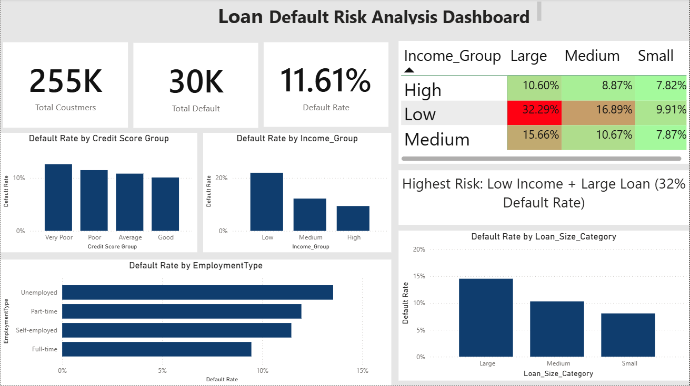
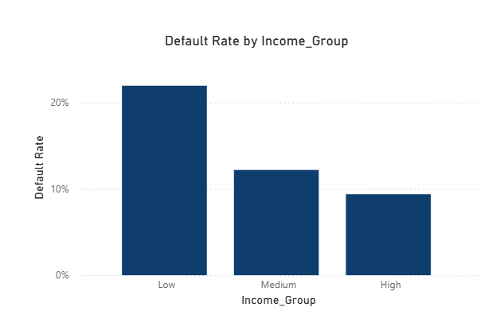
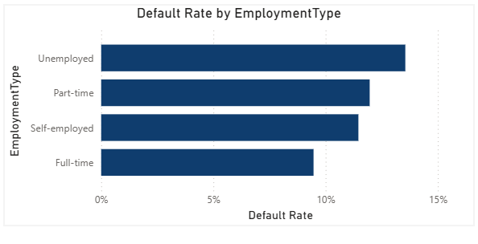
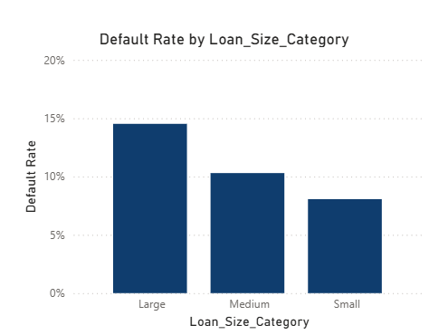
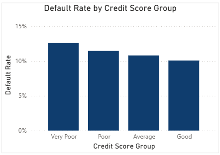
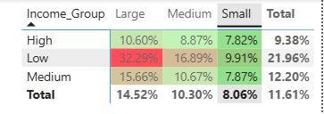

#  Loan Default Risk Analysis

##  Project Overview
This project analyzes loan default behavior using Excel and Power BI to identify key risk factors affecting loan repayment.

Loan default is a major challenge for financial institutions as it leads to financial losses and increased credit risk. This project applies data analysis techniques to understand borrower behavior and identify high-risk segments.

---

##  Objectives
- Calculate overall loan default rate  
- Identify key factors influencing default  
- Segment customers based on risk  
- Analyze combined impact of variables  
- Provide business recommendations  

---

##  Tools Used
- Excel – Data Cleaning & Analysis  
- Power BI – Dashboard & Visualization  

---

##  Key Insights
- Low income customers have higher default risk  
- Large loans increase default probability  
- Unemployed customers show higher risk  
- Highest risk segment:
  Low Income + Large Loan (~32% Default Rate)  

---

##  Dashboard Preview

---

##  Visual Analysis

### Income vs Default

### Employment vs Default

### Loan Size vs Default

### Credit Score vs Default

### Risk Heatmap

---

##  Report
Detailed report is available in the repository:
- Loan_Default_Risk_Analysis.pdf

---

##  Dataset
Due to file size limitations, dataset is shared via Google Drive:

https://docs.google.com/spreadsheets/d/1ftc4Fl-8y6CiPozxbbcYk9QlcZQNW1sy/edit?usp=drive_link&ouid=115642700362092779695&rtpof=true&sd=true

---

##  Power BI File
Due to file size limitations, Power BI file is shared via Google Drive:

https://drive.google.com/file/d/1ExOwJGGnAK-0Mn0ZLukA6iHN9_akVzA-/view?usp=drive_link

---

##  Business Recommendations
- Restrict large loans for low-income customers  
- Apply stricter approval for unemployed applicants  
- Use risk-based pricing  
- Implement multi-factor risk analysis  

---

##  Conclusion
This project demonstrates how data analytics can be used to identify high-risk customers and improve loan approval decisions.
